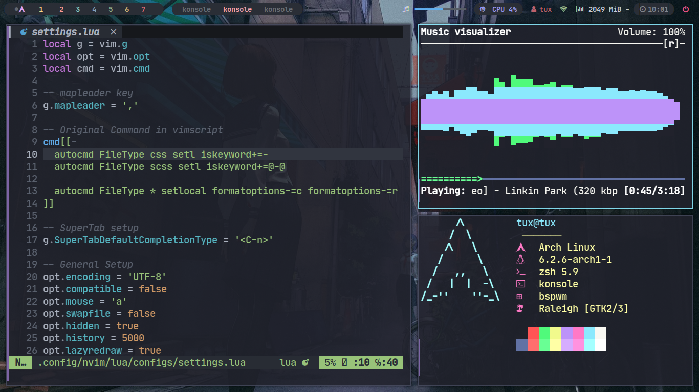

# Dotfiles

Configurações do meu ambiente de trabalho.

## Dependências
- [xorg](https://wiki.archlinux.org/title/Xorg_(Portugu%C3%AAs))
- [bspwm](https://wiki.archlinux.org/title/Bspwm)
- [sxhkd](https://wiki.archlinux.org/title/Sxhkd)
- [picom](https://wiki.archlinux.org/title/Picom)
- [polybar](https://wiki.archlinux.org/title/Polybar)
- [rofi](https://wiki.archlinux.org/title/Rofi)
- [konsole](https://wiki.archlinux.org/title/Konsole)
- [zsh](https://wiki.archlinux.org/title/Zsh)
- [starship](https://www.spacex.com/vehicles/starship/)
- [mpd](https://wiki.archlinux.org/title/Music_Player_Daemon)
- [ncmpcpp](https://wiki.archlinux.org/title/Ncmpcpp)
- [neovim](https://wiki.archlinux.org/title/Neovim)
- [packer](https://github.com/wbthomason/packer.nvim)

## Visualização




## Configuração

### Xorg

```bash
cd ~/
mv dotfiles/{.xinitrc,.Xresources,.xbindkeysrc} .
```

### bspwm

```bash
mv dotfiles/bspwm ~/.config

# wallpaper
mv dotfiles/Pictures $HOME
```

### sxhkd
```bash
mv dotfiles/sxhkd ~/.config
```

### fonts
```bash
mv dotfiles/fonts $HOME
fc-chace fv
```

### polybar

```bash
mv dotfiles/polybar ~/.config
```

### rofi
```bash
mv dotfiles/rofi ~/.config
```

### konsole

```bash
mv dotfiles/konsole ~/.config
```

### zsh

```bash
mv dotfiles/.zshrc $HOME
```

### neovim

```bash
cd dotfiles
mv nvim ~/.config
```
Entre no neovim e instale todos o plugins necessários com `:PackerInstall`.
